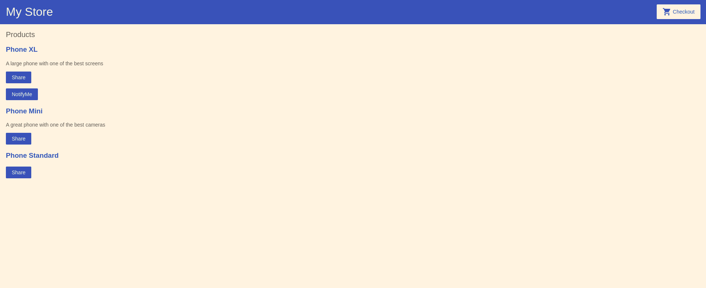

## e-commerce-angular

It's an e-commerce app that will allow the user to view different items and it's details and add them to the cart.  

## Built With

- Angular
- TypeScript

## Live Demo Link

[Project live website](https://e-commerce-app-a275c.web.app/)

## Getting Started

**To get started you can download the code by pressing in the top right corner on the green button**

> To get a local copy up and running follow these simple example steps.

### Prerequisites

- Npm installed on your computer
- Node as well
- Angular as well

### Install

> Once you have downloaded the code please open you terminal and paste in this code
> `git clone https://github.com/bot-killer-dot/e-commerce-angular.git`

### Usage

> In order to run the app once you have already installed it please run these commands in your terminal
> npm install
> `ng serve`
> Navigate to `http://localhost:4200/
> this will open a new browser with the app ready to use.

## Authors

👤 **Ameer Farooq**

- Github: [githubhandle](https://github.com/bot-killer-dot)
- Linkedin: [linkedin](https://www.linkedin.com/in/ameer-farooq1/)

## 🤝 Contributing

Contributions, issues, and feature requests are welcome!

Feel free to check the [issues page](https://github.com/bot-killer-dot/e-commerce-angular/issues).

## Show your support

Give a ⭐️ if you like this project!

## 📝 License

This project is [MIT](lic.url) licensed.
